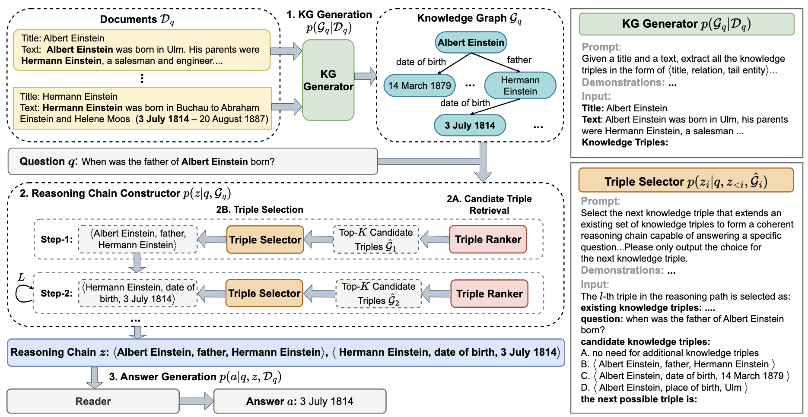

# TRACE the Evidence: Constructing Knowledge-Grounded Reasoning Chains for Retrieval-Augmented Generation

This repository contains the official implementation of our TRACE framework. Details about TRACE can be found in our [paper](https://aclanthology.org/2024.findings-emnlp.496.pdf). 

## Introduction 
Retrieval-augmented generation (RAG) offers an effective approach for addressing question answering (QA) tasks. However, the imperfections of the retrievers in RAG models often result in the retrieval of irrelevant information, which could introduce noises and degrade the performance, especially when handling multi-hop questions that require multiple steps of reasoning.  To enhance the multi-hop reasoning ability of RAG models, we propose TRACE. TRACE constructs *knowledge-grounded reasoning chains*, which are a series of logically connected knowledge triples, to identify and integrate supporting evidence from the retrieved documents for answering questions. Specifically, TRACE first employs a KG Generator to create a knowledge graph (KG) from the retrieved documents, and then uses an Autoregressive Reasoning Chain Constructor to build reasoning chains. Given the reasoning chains, the TRACE reader either directly uses them as context to generate the answer (TRACE-Triple) or use the triples within these chains to retrieve their original documents and then uses these documents as the context to generate the answer (TRACE-Doc). 

<figure style="text-align: center;">
  
  <figcaption>Overview of TRACE.</figcaption>
</figure>

## Prepare Data 
The datasets used in our experiments can be downloaded from their official websites: [HotPotQA](https://hotpotqa.github.io/), [2WikiMultiHopQA](https://github.com/Alab-NII/2wikimultihop), [MuSiQue](https://github.com/StonyBrookNLP/musique). 

After downloading the dataset, run the following command to create the development and test sets used in our experiments: 

```
python preprocessing_data.py \
    --dataset hotpotqa \
    --raw_data_folder data/hotpotqa/raw_data \
    --save_data_folder data/hotpotqa 
```
where `--raw_data_folder` specifies the folder containing the raw data and `--save_data_folder` denotes the folder where the development and test data will be saved. 


## Evaluation of TRACE 

TRACE uses the following steps to answer multi-hop questions: (1) KG generation; (2) reasoning chain construction; (3) answer generation. 
We provide commands for each of these steps and the prompts for these steps can be found in the `prompts/` folder. 

If you are only interested in the final results, you can download our generated data from [here](https://osf.io/p9ymg/?view_only=ad39cfb2c229493888e1e48fb44bd4a9) and skip directly to the Answer Generation step to evaluate the performance by running the provided command. 

### 1. KG Generation 
Run the followiing command to generate KGs: 
```
python generate_knowledge_triples.py \
    --dataset hotpotqa \
    --input_data_file data/hotpotqa/dev.json \
    --save_data_file data/hotpotqa/dev_with_kgs.json 
```
We use LLaMA3 from huggingface as the backbone model to generate KGs. To access the LLaMA3 model, update the `HF_TOKEN` in the `utils/const.py` file with an authorised token. 

### 2. Reasoning Chain Construction 
Run the following command to construct reasoning chains:
```
python construct_reasoning_chains.py \
  --dataset hotpotqa \
  --input_data_file data/hotpotqa/dev_with_kgs.json \
  --output_data_file data/hotpotqa/dev_with_reasoning_chains.json \
  --calculate_ranked_prompt_indices \
  --max_chain_length 4 
```
The `calculate_ranked_prompt_indices` parameter denotes whether to use a retriever model to adaptively choose demonstrations for each question. The number of demonstrations can be set with the `num_examplars` parameter. Additionally, the number of candidate triples $K$ can be set with `num_choices` parameter. 

### 3. Answer Generation 
Run the following command to evaluate the QA performance: 
```
python evaluation.py \
  --test_file data/hotpotqa/dev_with_reasoning_chains.json \
  --reader llama3 \
  --context_type triples \
  --n_context 5 
```
`reader`: Specifies the reader model used for evaluation. Current options are ["llama3", "mistral", "gemma"]. To access some of these models, update the `HF_TOKEN` in the `utils/const.py` to an authorised token. 

`context_type`: Specifies the type of the context. Setting it to "triples" denotes the TRACE-Triple method. Setting it to "documents" denotes the TRACE-Doc method. Setting it to "all_documents" denotes using all the documents as context. 

`num_context`: Specifies the number of reasoning chains used for each question. 


## Contact: 
If you have any questions about the code, feel free to contact me via fangjy6@gmail.com. 